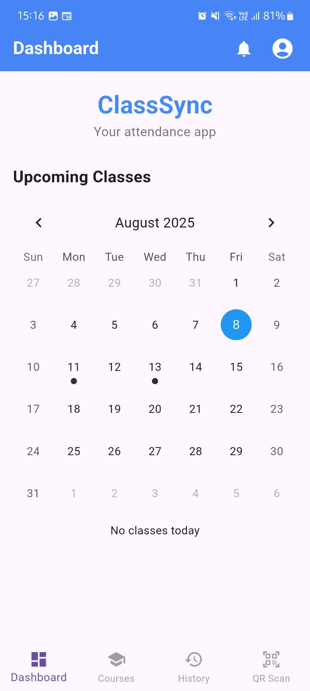
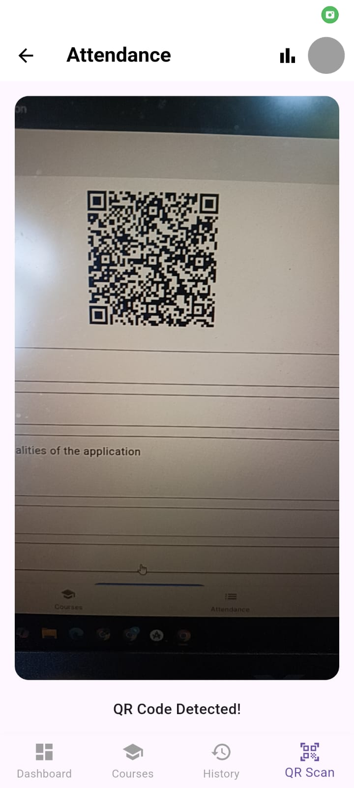
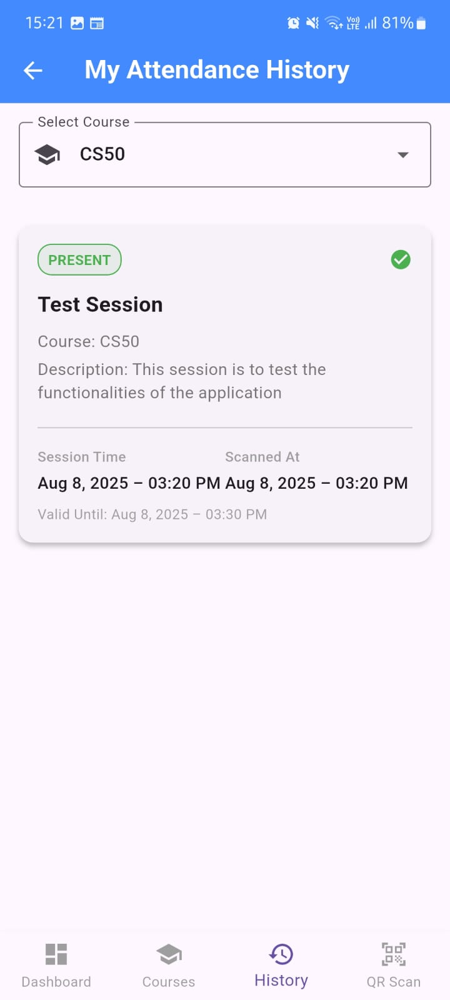
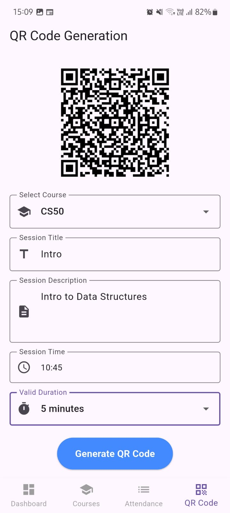
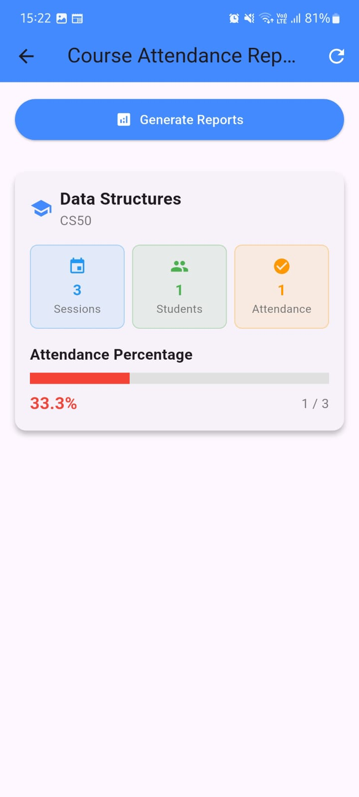
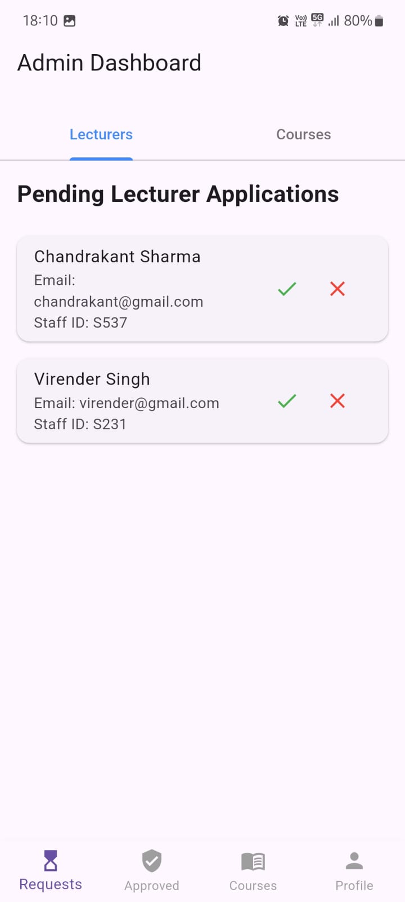

# 📱 ClassSync - QR Code Attendance Management System

> A Flutter-based mobile application to streamline attendance management in educational institutions using QR code technology.

---

## 📌 Project Overview

**ClassSync** is a comprehensive attendance management system designed for students, lecturers, and administrators. With secure Firebase backend integration and QR code-powered attendance tracking, it offers a seamless, modern solution to classroom management.

---

## 🎯 Key Features

### 🔐 Multi-Role Authentication
- **Student Login**: Firebase Email/Password authentication  
- **Lecturer Login**: Admin-approved lecturer access  
- **Admin Login**: Central control panel  
- **Password Reset**: Email-based recovery for all users

---

### 👨‍🎓 Student Features
- 📷 **QR Code Scanning**: Scan QR codes for class attendance  
- 📚 **Course Registration**: Register for available courses  
- 📊 **Attendance History**: View detailed logs with timestamps  
- 🏠 **Dashboard**: Upcoming classes and recent activity  
- 🧑‍💼 **Profile Management**: Update personal info and preferences  

---

### 👨‍🏫 Lecturer Features
- 🔐 **QR Code Generation**: Time-limited codes for sessions  
- 📆 **Session Management**: Schedule classes with details  
- 📈 **Attendance Monitoring**: Track real-time attendance  
- 📋 **Course Assignment**: View assigned courses  
- 📝 **Reports Generation**: Analytics and statistics  
- 🧑‍💼 **Profile Management**: Manage teaching profile  

---

### 🧑‍💼 Admin Features
- ✅ **Lecturer Approval**: Review and approve applications  
- 🏫 **Course Management**: Add, edit, and delete courses  
- 📌 **Course Assignment**: Assign courses to lecturers  
- 🔍 **System Oversight**: Monitor all activities  
- 📝 **Application Processing**: Manage course requests  

---

## 🏗️ Technical Architecture

### 🖼️ Frontend
- **Framework**: Flutter (Dart)  
- **UI**: Material Design + custom theming  
- **Navigation**: Bottom Navigation + Role-based Routing  
- **State Management**: `StatefulWidget`

### 🛠️ Backend & Database
- **Firebase Auth**: Authentication and session handling  
- **Cloud Firestore**: Real-time NoSQL database  
- **Firebase Storage**: Profile images, QR code storage  

---

## 📂 Database Structure

```
students           → Student profiles and registration  
lecturers          → Lecturer profiles and approval status  
admins             → Admin user accounts  
courses            → Course details and assignments  
registrations      → Student course registrations  
sessions           → QR code session metadata  
session_attendance → Actual attendance records  
course_applications → Lecturer course requests  
scheduled_classes  → Class session timings  
```

---

## 🔄 Workflow

### 👨‍🎓 Student Workflow
1. Register with email and personal info  
2. Register for available courses  
3. Scan QR code to mark attendance  
4. View attendance logs and stats  

### 👨‍🏫 Lecturer Workflow
1. Apply for lecturer role  
2. Receive course assignments  
3. Generate QR codes for sessions  
4. Monitor attendance and generate reports  

### 🧑‍💼 Admin Workflow
1. Approve or reject lecturer applications  
2. Create and manage course catalog  
3. Assign courses to lecturers  
4. Monitor system usage and analytics  

---

## 🚀 Installation & Setup

### ✅ Prerequisites
- Flutter SDK `^3.7.0`  
- Firebase Project  
- Android Studio / VS Code  

### 🔧 Setup Instructions
```bash
git clone https://github.com/your-username/classsync.git
cd classsync
flutter pub get
```

### 🔥 Firebase Configuration
- Create Firebase Project  
- Add `google-services.json` in `android/app/`  
- Enable Email/Password Authentication  
- Set up Firestore and Storage  
- Configure Firestore Rules  

---

## 📸 Screenshots

Below are the key interfaces of the **QR Attendance System**:

---

## 📸 Screenshots

Below are the key interfaces of the **QR Attendance System**:

---

### 🧑‍🎓 Student Dashboard  
A centralized dashboard for students to view and manage their attendance details.



---

### 📷 QR Scanning Interface  
Interface for scanning QR codes to mark attendance.



---

### 📚 Course Registration  
Students can register for courses they are enrolled in.


---

### 📅 Attendance History  
View detailed history of attendance with timestamps and course info.



---

### 🧑‍🏫 QR Code Generation (Lecturer)  
Lecturers can generate QR codes for each class session.



---

### 📊 Attendance Reports  
Detailed reports showing student attendance per course.



---

### 🛠️ Admin Dashboard  
Admin panel for managing users, courses, and system-level configurations.



---

### 📁 More Screens Available  
👉 **Check out the [`/screenshots/`](screenshots/) folders (`admin/`, `student/`, `lecturer/`, `common/`) in the repository for all available UI screens.**

---

## ⚙️ Configuration

### 🔐 Firebase Setup
- Enable Email/Password Auth  
- Create Firestore DB  
- Set Firestore rules  
- Enable Storage for uploads  

### 🌍 Environment Variables
- Add Firebase config in `main.dart`  
- Set web credentials for cross-platform support  

---

## 🛡️ Security Features

- **Role-Based Access Control**  
- **Secure Firebase Auth Sessions**  
- **Input Validation & Error Handling**  
- **Time-Limited QR Codes**  
- **Duplicate Attendance Prevention**

---

## 📊 Analytics & Reporting

### 👨‍🎓 Student
- Attendance % per course  
- History with timestamps  
- Performance trends

### 👨‍🏫 Lecturer
- Course-wise stats  
- Participation rates  
- Effectiveness metrics  

### 🧑‍💼 Admin
- Global attendance data  
- System usage insights  
- Course popularity  

---

## 🔴 Real-time Features

- ✅ Live Attendance Updates  
- 🧑‍💻 Live Participant Count  
- 🔔 Instant Status Notifications  
- 🔄 Cloud Data Sync  

---

## 🎨 UI/UX Features

- Modern Material Design  
- Responsive for all screen sizes  
- Role-based Tab Navigation  
- Success/Error Feedback  
- Accessible for diverse needs  

---

## 🚀 Deployment

- 📱 Android  
- 📱 iOS  
- 🌐 Web (Flutter Web)

---

## 🤝 Contributing

```bash
# Steps to contribute:
- Fork the repository
- Create a feature branch
- Make your changes
- Add tests if needed
- Submit a pull request
```

---

## 📄 License

This project is licensed under the [MIT License](LICENSE).

---

## 👥 Team

- **Developer**: [Dhruv Gupta]  
- **Design**: Material Design with custom theming  
- **Backend**: Firebase (Auth, Firestore, Storage)

---

## 📞 Support

- Open an issue on GitHub    

---

> *ClassSync — Making attendance management seamless and efficient!* 🎓✨
